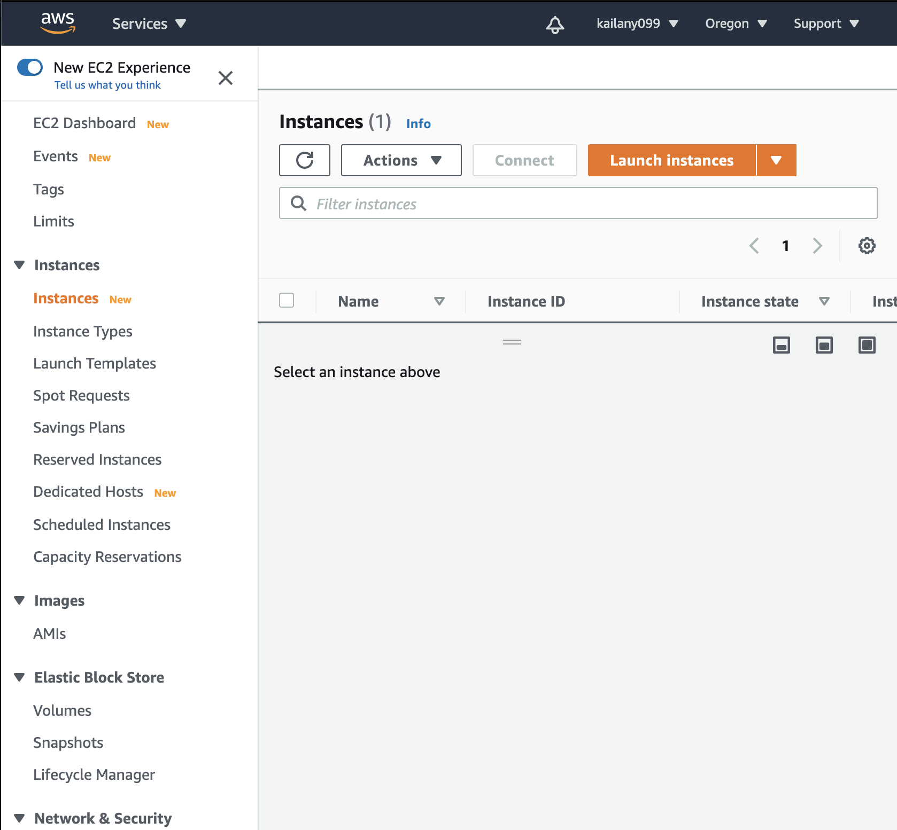
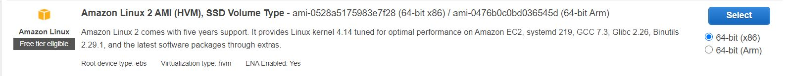
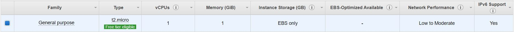
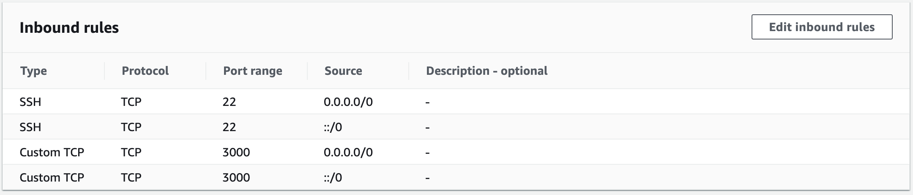
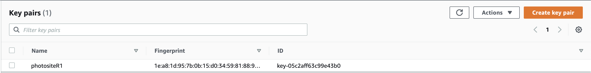
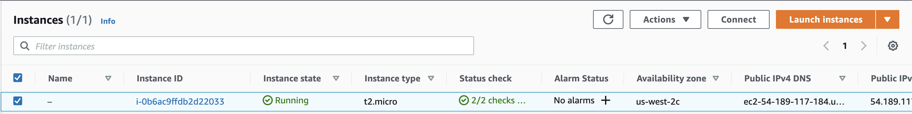
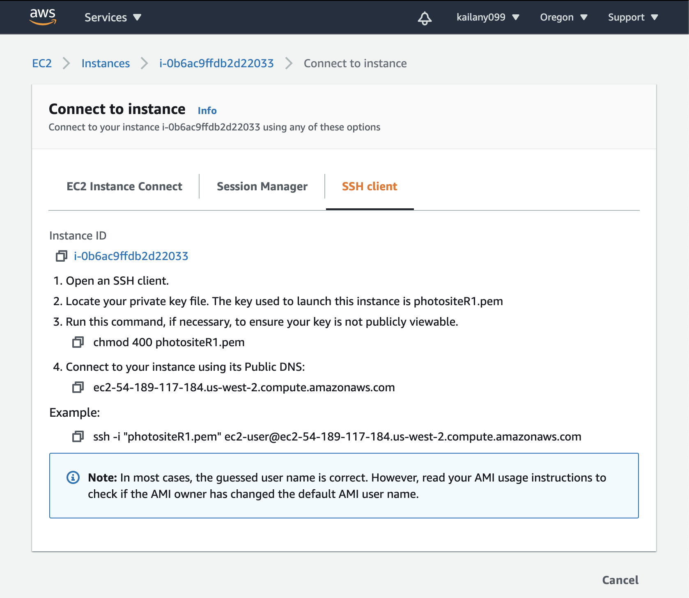
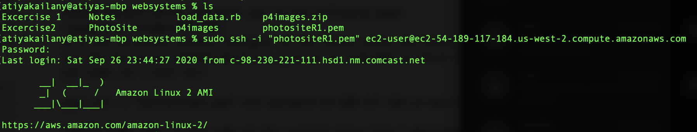
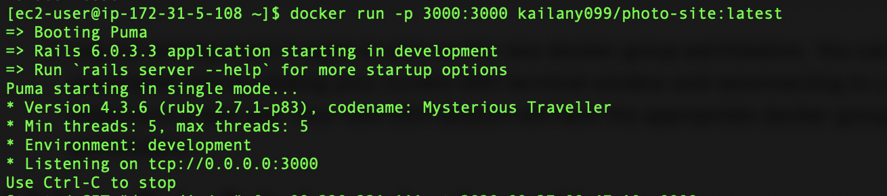
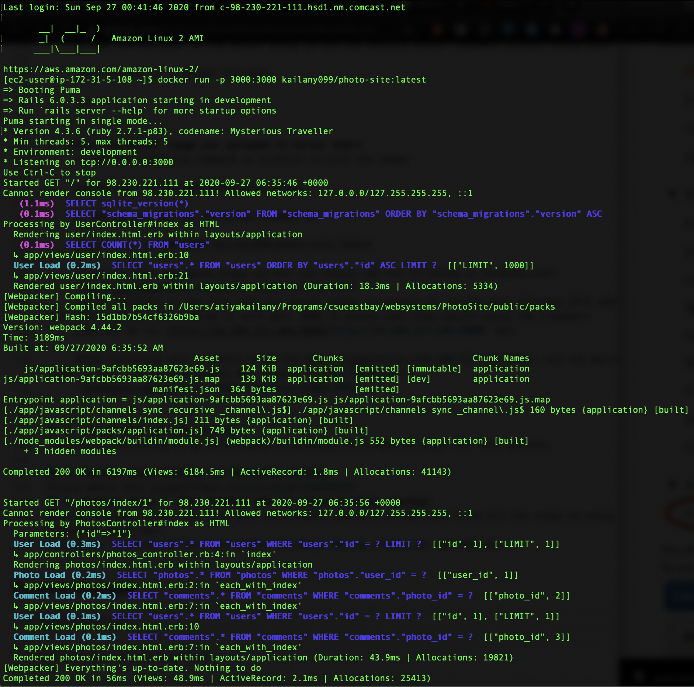

# A simple PhotoSite (RoR) project, dockerized and deployed on Amazon's AWS Elastic Container Service (EC2)

## Table of Contents
1. [Intro and Purpose](#1-intro-and-purpose)
	  - [Creating the EC2 instance](#create-ec2)
	  - [Creating a local docker image and pushing it to the Docker Hub](#create-docker-container)
2. [Demo of the RoR application running on AWS](#2-demonstration-of-application-working)
3. [Things that are not working](#3-things-that-are-not-working)
4. [YouTube Video demoing the PhotoSite working](#4-youtube-walkthrough)
5. [Special Issue 1: What happens when an instance stops running?](#5-adv---what-happens-when-an-instance-stops-running-what-shall-i-do)
6. [Special Issue 2: What happens when you reboot an instance and what can you do?](#6-adv---what-happens-when-you-reboot-an-instance-what-can-be-done)

<br>

## 1. Intro and Purpose

This repo contains a simple Ruby on Rails (RoR) project that mimics a photo site application. The website contains two URL's. The first URL (**user/index**) shows a list of the user's which is obtained from a SQLite database and links to each user's profile.<br>

The second URL (**photo/index/:id**) contains the profile of that specific user as well as their immages. In addition, these immages have a comment section that displays comments made by other users on the picture. All users are linkable profiles.<br>

<a name = "create-ec2" /> <br>

**Creating the EC2 instance** <br>
Follow the YouTube video in this [link](youtube link to create and configure EC2) <br>

<a name = "create-docker-container" /> <br>

**Creating a local docker image and pushing it to the Docker Hub** <br>

1. Create a **Dockerfile** with the following: <br>
	```
     
	#Base image
     FROM ruby:latest
     
     ENV HOME /Users/atiyakailany/Programs/csueastbay/websystems/PhotoSite
     
     WORKDIR $HOME
     
     #Instal gems
     ADD Gemfile* $HOME/
     RUN bundle install
     
     #Install dependencies
     RUN apt-get update -qq && apt-get install -y sqlite3 libsqlite3-dev
     RUN curl -sS https://dl.yarnpkg.com/debian/pubkey.gpg | apt-key add -
     RUN echo "deb https://dl.yarnpkg.com/debian/ stable main" | tee /etc/apt/sources.list.d/yarn.list
     RUN apt-get update -qq && apt-get install -y yarn
     RUN yarn install
     
     #Add the app code
     ADD . $HOME
     
     #Port mapping
     EXPOSE 3000
     
     #Default command
     CMD ["rails", "server", "-b", "0.0.0.0"]
	```
	Docker's official site on setting up Dockerfile's [link](https://docs.docker.com/develop/develop-images/dockerfile_best-practices/).<br>

2. Next up, we build our docker image using the following command<br>
	```
	docker build -t kailany099/photo-site:latest .
	```
	This command creates a docker image called "kailany099/photo-site" with the "latest" tag<br>

3. We now have to launch our container locally to make sure the docker image is working properly<br>
	```
	docker run -p 3000:3000 kailany/photo-site:latest
	```
	This command will run a local host docker container from the image we built in the previous step. If y      if you did everything correctly, you should now be able to access you're website using a local host        with port 3000 without having to use the RubyMine IDE<br>
     
4. Publish your docker image to the Docker Hub <br>
	We run the following in the command line<br>
	```
	sudo docker login registry-1.docker.io
	```
	Most people online did not have to use sudo, but for me it wouldn't push to the hub without it. So          using sudo varries based on your environment. This will ask you to enter Docker Hub username and            password. <br>
	Next we push our Docker image to the registy<br>
	```
	docker push kailany099/photo-site:latest
	```
	Now this image is avaiable via the internet so we will be able to pull it on our EC2 instance.<br>
	


## 2. Demo of the RoR application running on AWS
1. **Set up Amazon EC2** <br>
	You need to sign up with an Amazon AWS account beofre you can perform these steps.
	1. Navigate to the EC2 Dashboard, and click on instances on the left menu.<br>
		 <br>
		Now click on the Launch Instances<br>
		
	2. Select the following free tier AMI.<br>
		 <br>
		
	3. Choose the Instance type <br>
		 <br>
		
	4. Configure the Security group <br>
		 <br>
		
	  I am only opening port 3000 as shown in the above picture, because I am exposing it in my Dockerfile<br>
	  
	5. Create a new key pair. I don't have a good screenshot but this is my key pair "photositeR1"<br>
		
		You also might be prompted to download a certification file which you will later use to access this instance<br>
		
2. **Connect to your EC2 instance via ssh** <br>
	
     <br>
	
     Choose Connect which redirects you to the following page:
	<br>
	
	In a new teriminal window, navigate to the folder where you downloaded the keypair certification and run the following command which was give to us from AWS as shown in the above image (You might need to use sudo, as I did) <br>
	```
	sudo ssh -i "photositeR1.pem" ec2-user@ec2-54-189-117-184.us-west-2.compute.amazonaws.com
	```
	"photositeR1.pem" is the name of the certification file I mentioned above<br>
     
     If you did all the above steps correctly, you will be treated with the following terminal message <br>
	
	<br>
3. **Pulling Docker on your EC2 instance and running it** <br>
     I used the following commands which I obtained from this [link](https://docs.aws.amazon.com/AmazonECS/latest/developerguide/docker-basics.html).<br>
     
	1.Update installed packages on your instance
	```
	sudo yum update -y
	```
	2. Install most recent Docker Community Edition package for Amazon Linux 2
	```
	sudo amazon-linux-extras install docker
	```
	3. Start the Docker service.
	```
	sudo service docker start
	```
	4. Add the ec2-user to the docker group so you can execute Docker commands without using sudo.
	```
	sudo usermod -a -G docker ec2-user
	```
     <br>


4. **Pull the Docker image you uploaded on Docker Hub**
	1. Run the following command in terminal to pull the image
	```
	docker pull kailany099/photo-site:latest
	```
	2. Now we can use the following command to run your docker image on the instance
	```
	docker run -p 3000:3000 kailany099/photo-site:latest
	```
     If you've done the above steps correctly you should see the following in terminal:<br>
     
	You're instance is now live with the docker image, to access it, locate your instance IPv4 address from AWS's website and combine it with port 3000 to access your Ruby website using the cloud<br> 
     Link for me is: [http://54.189.117.184:3000](http://54.189.117.184:3000) <br>
     
     After accessing your instance using the above [link](http://54.189.117.184:3000), you can monitor usage of your instance on Amazon AWS console as seen below:<br>
     
     
	
## 3. Things that are not working
Thankfully everything in my environment is working, so I have no input for this section.

## 4. YouTube Video demoing the PhotoSite working
Please watch this [link](https://youtu.be/gT-Uw3nV728)
## 5. Special Issue 1: What happens when an instance stops running?
The problem that rises when an instance stops is that you lose the whole set up for your environment and data. So when you launch your instance again you will be forced to re-set up your instance again following all the tedious above steps mentioned.<br>

To alleviate this issue, we can create our own AMI, using the instance that we want to create an image of. So next time if you're instance stops running, you can create a new instance using that image, although you still have to re-configure your instance. However, when you access this instance you will find that your environment and data is still there so you don't have to download or set up anything.<br>

Thus, you can casually use a ''' docker run ''' command as demonstrated above and you'll be up and running again. Keep in mind, this new instance has a different IPv4 address, so you will need to use that to access your website again.<br>
	

## 6. Special Issue 2: What happens when you reboot an instance and what can you do?
When you reboot an instance, it acquires a new different IP address, so you can no longer access it with whatever IP address you have been using.<br>

How to prevent this problem from occurring, we can use **Elastic IP addresses**. You can achieve that by creating an Elastic IP Address then associating that address to your instance using the AWS management console.<br>

If done correctly, you will now be able to access your instance online with the Elastic IP Address.


